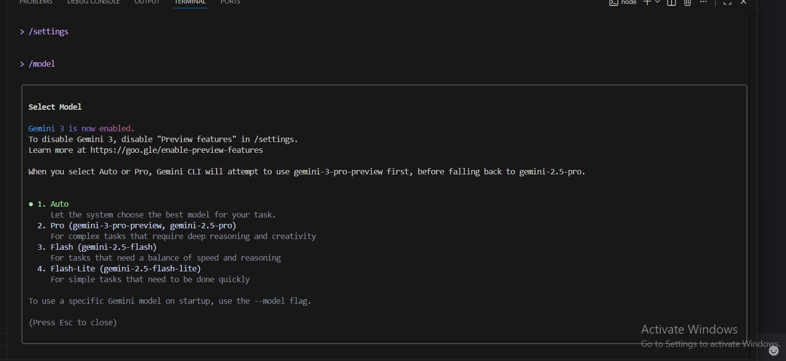

# 🌟 PART A — Research Questions (Short
Answers)

### Q1. What new improvements were introduced in Gemini 3.0?

Here are the key improvements in Gemini 3.0:

- **Smarter Thinking:** It is much better at reasoning and solving complex problems.

- **Better Understanding of Everything:** It has enhanced multimodal understanding. This means it understands and works with text, pictures, video, and code better than before.

- **New Ways to See Answers:** It can create new, more visual and interactive answer layouts (like a magazine or an interactive guide) instead of just plain text.

- **Gemini Agent:** It can handle and finish complex, multi-step tasks for you, like organizing your email or planning a trip.

- **Better Code:** It is a much stronger model for writing and understanding computer code.

### Q2. How does Gemini 3.0 improve coding & automation workflows?

emini 3.0 makes coding and automation much easier in these simple ways:

- **Better Code Generator:** It is much better at creating accurate computer code for you from a simple idea.

- **"Vibe Coding":** You can tell it what you want an app or website to look like using simple language (like "Make a clean, minimalist design with a dark background"), and it can build the code for it.

- **Handling Big Jobs:** It can read and understand a very large amount of code at once, which helps with fixing problems or adding big new features to an existing project.

- **Smarter Agents:** It can act like a smart helper (an "agent") that can plan and complete several steps for a task all by itself, like:

- Find a bug in your code.

- Fix the bug.

- Write a note explaining the fix.

In short, it helps you write better code faster and can automate complex work that used to take many steps.

### Q3. How does Gemini 3.0 improve coding & automation workflows?

Gemini 3.0 helps beginners with coding and automation in two simple ways:

- **Smarter Coding:**

It helps you write better, cleaner code just by describing what you want in simple English (like "vibe coding").

It can read and understand huge projects to find and fix mistakes or add new parts.

- **Smarter Automation (Agents):**

It acts as a super-smart helper (Agent) that can complete many steps of a task all by itself without you having to guide every little thing.

**Example:** You ask it to "find the slow part of the website, fix the code, and write a summary of the change," and it can do all three steps automatically.

**In short,** it helps you write code faster and automates multi-step jobs.

### Q4. The two main developer tools introduced with Gemini 3.0 are:
**1. Google Antigravity:** This is a new platform where a smart AI agent can plan and do complex, multi-step coding tasks for you across an editor, terminal, and browser.

**2. Gemini CLI:** This is a command-line tool that lets you use the power of the Gemini AI model directly in your computer's terminal (the place where developers type commands).

# 🌟 PART B — Practical Task (Screenshot Required)

